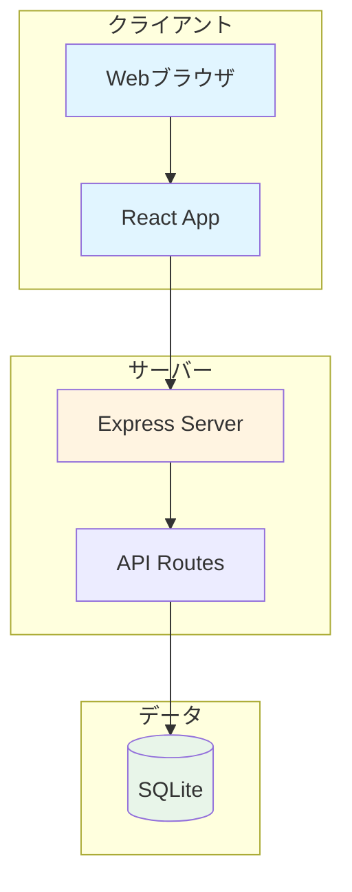

# 手帳（Techo）システム ドキュメント

このディレクトリには、手帳アプリケーションのシステム構成に関するドキュメントが含まれています。

## ドキュメント一覧

### 📐 [システムアーキテクチャ](./architecture.md)
システム全体の構成、技術スタック、ディレクトリ構造、通信フローを説明します。

**主な内容**:
- システム構成図
- 技術スタック一覧
- ディレクトリ構造
- 通信フロー（シーケンス図）
- デプロイ構成

### 🗄️ [データベース設計](./database.md)
データベースのER図、テーブル定義、データフローを説明します。

**主な内容**:
- ER図（Entity Relationship Diagram）
- テーブル定義詳細
- データベース初期化プロセス
- データフロー例（シーケンス図）

### 🎨 [フロントエンド構成](./frontend.md)
Reactコンポーネントの階層、ルーティング、データフローを説明します。

**主な内容**:
- コンポーネント階層図
- ルーティング構成
- コンポーネント詳細（クラス図）
- カスタムフック
- データフロー（シーケンス図）
- スタイリング

### 🔌 [API仕様書](./api.md)
すべてのAPIエンドポイントの詳細仕様を説明します。

**主な内容**:
- API構成図
- エンドポイント一覧
- リクエスト/レスポンス形式
- 各エンドポイントの動作（シーケンス図）
- エラーハンドリング

## システム概要図



## 主要機能

1. **デイリーページ** (`/daily`)
   - スケジュールタイムライン（6時〜24時）
   - 日記機能
   - 習慣トラッカー（過去7日間）

2. **目標管理ページ** (`/goals`)
   - ガントチャート表示
   - カテゴリ別グループ化
   - 進捗率管理

## 開発環境セットアップ

```bash
# 依存関係のインストール
npm install

# 開発サーバー起動（クライアント + サーバー）
npm run dev

# クライアントのみ
npm run dev:client

# サーバーのみ
npm run dev:server

# ビルド
npm run build
```

## ドキュメントの見方

各ドキュメントには、**Mermaid形式のUML図**が含まれています：

- **フローチャート**: システム構成、コンポーネント階層
- **ER図**: データベースの関係性
- **シーケンス図**: データフロー、API通信
- **クラス図**: コンポーネント構造
- **ステート図**: ルーティング状態

これらの図は、GitHubや多くのMarkdownビューアーで自動的にレンダリングされます。

## 関連ファイル

- `package.json` - 依存関係とスクリプト
- `vite.config.ts` - Vite設定
- `server/index.ts` - サーバーエントリーポイント
- `src/App.tsx` - アプリケーションルート
- `server/db.ts` - データベース接続・初期化
