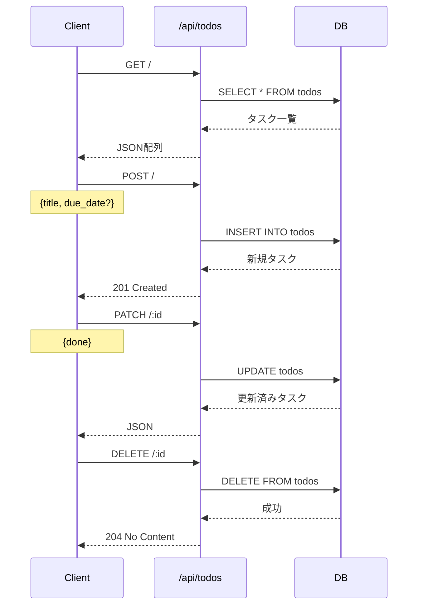
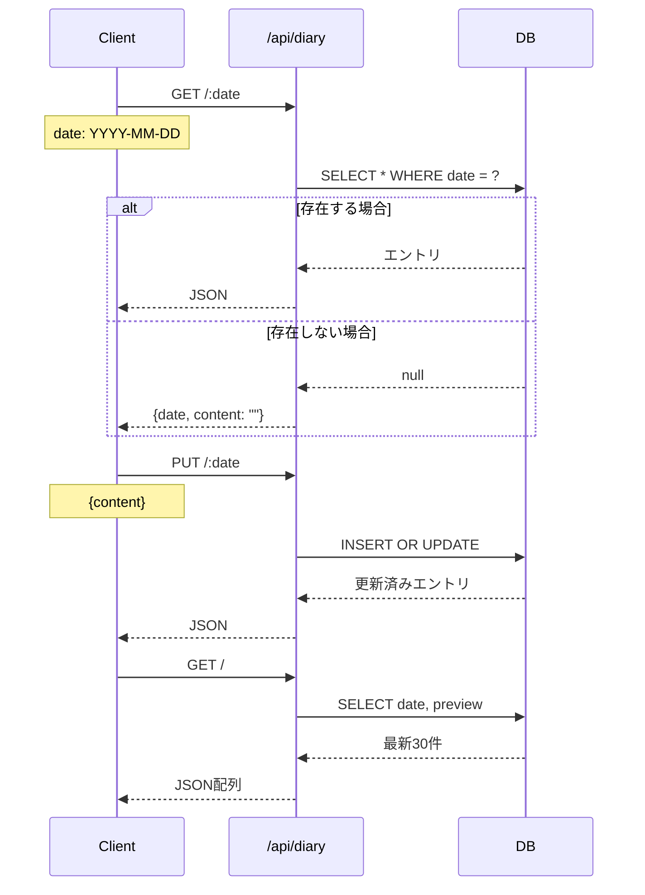
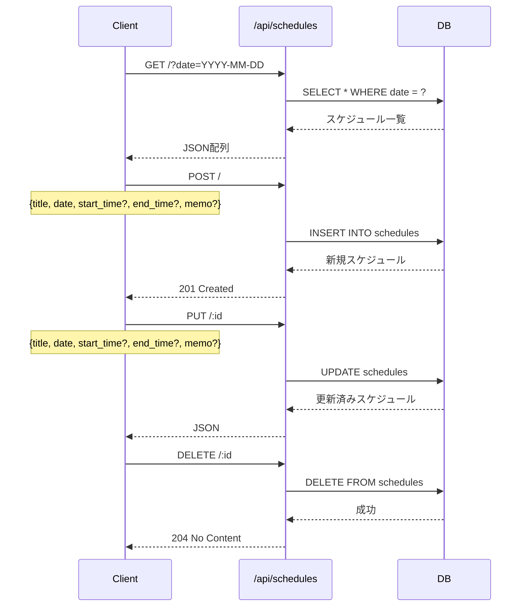
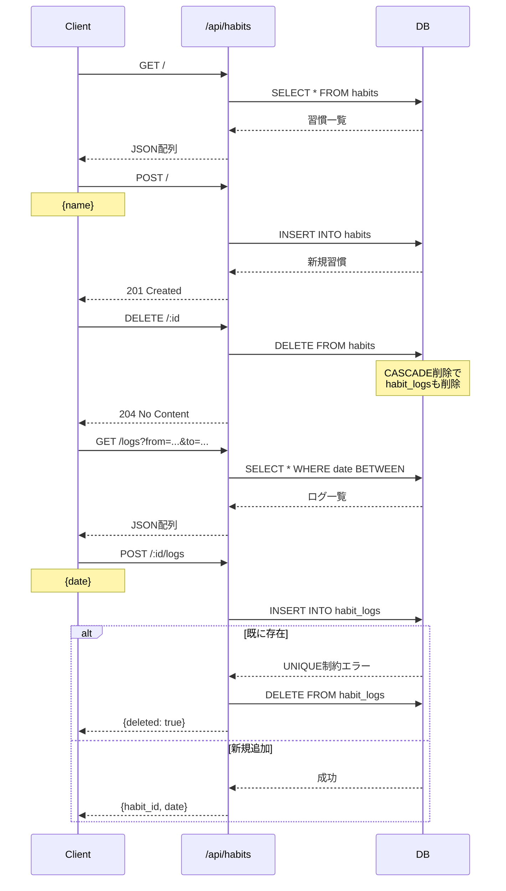
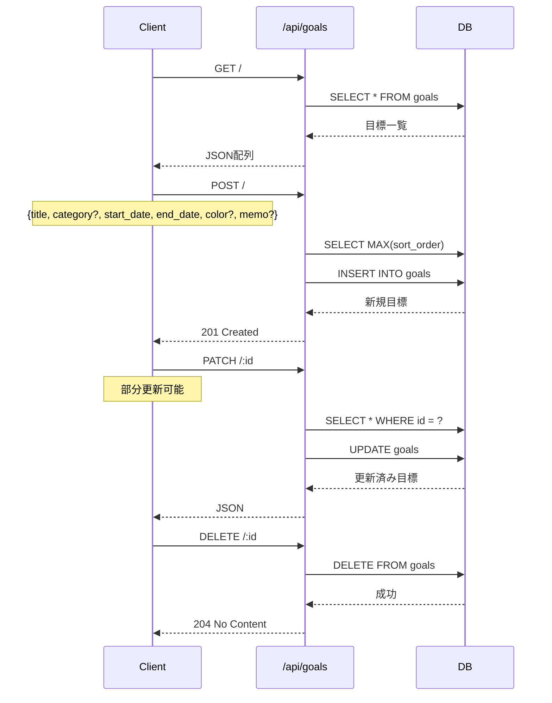

# API仕様書

## API概要

すべてのAPIエンドポイントは `/api` プレフィックスで始まります。  
ベースURL: `http://localhost:3001/api`

## API構成図

```mermaid
graph TB
    subgraph "Express Server :3001"
        Express[Express App]
        CORS[CORS Middleware]
        JSON[JSON Parser]
    end

    subgraph "API Routes"
        Todos[/api/todos]
        Diary[/api/diary]
        Schedules[/api/schedules]
        Habits[/api/habits]
        Goals[/api/goals]
    end

    subgraph "Database"
        DB[(SQLite)]
    end

    Express --> CORS
    CORS --> JSON
    JSON --> Todos
    JSON --> Diary
    JSON --> Schedules
    JSON --> Habits
    JSON --> Goals
    Todos --> DB
    Diary --> DB
    Schedules --> DB
    Habits --> DB
    Goals --> DB

    style Express fill:#fff4e1
    style DB fill:#e8f5e9
```

## エンドポイント一覧

### タスク管理 API (`/api/todos`)



#### GET `/api/todos`

**説明**: すべてのタスクを取得

**レスポンス**:
```json
[
  {
    "id": 1,
    "title": "タスク名",
    "done": 0,
    "due_date": "2024-01-15",
    "created_at": "2024-01-01 10:00:00"
  }
]
```

**ソート**: `done ASC, created_at DESC`（未完了優先、新しい順）

---

#### POST `/api/todos`

**説明**: 新しいタスクを作成

**リクエストボディ**:
```json
{
  "title": "タスク名",
  "due_date": "2024-01-15"  // オプション
}
```

**レスポンス**: `201 Created`
```json
{
  "id": 1,
  "title": "タスク名",
  "done": 0,
  "due_date": "2024-01-15",
  "created_at": "2024-01-01 10:00:00"
}
```

---

#### PATCH `/api/todos/:id`

**説明**: タスクの完了状態を更新

**リクエストボディ**:
```json
{
  "done": 1  // 0: 未完了, 1: 完了
}
```

**レスポンス**:
```json
{
  "id": 1,
  "title": "タスク名",
  "done": 1,
  "due_date": "2024-01-15",
  "created_at": "2024-01-01 10:00:00"
}
```

---

#### DELETE `/api/todos/:id`

**説明**: タスクを削除

**レスポンス**: `204 No Content`

---

### 日記 API (`/api/diary`)



#### GET `/api/diary/:date`

**説明**: 指定日付の日記を取得

**パラメータ**:
- `date`: 日付（YYYY-MM-DD形式）

**レスポンス**:
```json
{
  "id": 1,
  "date": "2024-01-01",
  "content": "今日の日記内容...",
  "updated_at": "2024-01-01 20:00:00"
}
```

**注意**: 存在しない場合は空のコンテンツを返す

---

#### PUT `/api/diary/:date`

**説明**: 日記を保存・更新

**パラメータ**:
- `date`: 日付（YYYY-MM-DD形式）

**リクエストボディ**:
```json
{
  "content": "日記の内容"
}
```

**レスポンス**:
```json
{
  "id": 1,
  "date": "2024-01-01",
  "content": "日記の内容",
  "updated_at": "2024-01-01 20:00:00"
}
```

**動作**: `INSERT ... ON CONFLICT DO UPDATE` で新規作成または更新

---

#### GET `/api/diary`

**説明**: 日記の一覧を取得（最新30件、プレビュー付き）

**レスポンス**:
```json
[
  {
    "date": "2024-01-01",
    "preview": "今日の日記内容の最初の50文字..."
  }
]
```

---

### スケジュール API (`/api/schedules`)



#### GET `/api/schedules`

**説明**: スケジュールを取得

**クエリパラメータ**:
- `date` (オプション): 日付（YYYY-MM-DD形式）でフィルタ

**レスポンス**:
```json
[
  {
    "id": 1,
    "title": "会議",
    "date": "2024-01-01",
    "start_time": "10:00",
    "end_time": "11:00",
    "memo": "会議室A"
  }
]
```

**ソート**: 
- 日付指定時: `start_time ASC`
- 全件取得時: `date ASC, start_time ASC`

---

#### POST `/api/schedules`

**説明**: 新しいスケジュールを作成

**リクエストボディ**:
```json
{
  "title": "会議",
  "date": "2024-01-01",
  "start_time": "10:00",  // オプション
  "end_time": "11:00",    // オプション
  "memo": "会議室A"       // オプション
}
```

**レスポンス**: `201 Created`
```json
{
  "id": 1,
  "title": "会議",
  "date": "2024-01-01",
  "start_time": "10:00",
  "end_time": "11:00",
  "memo": "会議室A"
}
```

---

#### PUT `/api/schedules/:id`

**説明**: スケジュールを更新

**リクエストボディ**: POSTと同じ

**レスポンス**: 更新済みスケジュール

---

#### DELETE `/api/schedules/:id`

**説明**: スケジュールを削除

**レスポンス**: `204 No Content`

---

### 習慣 API (`/api/habits`)



#### GET `/api/habits`

**説明**: すべての習慣を取得

**レスポンス**:
```json
[
  {
    "id": 1,
    "name": "運動",
    "created_at": "2024-01-01 10:00:00"
  }
]
```

**ソート**: `created_at ASC`

---

#### POST `/api/habits`

**説明**: 新しい習慣を作成

**リクエストボディ**:
```json
{
  "name": "運動"
}
```

**レスポンス**: `201 Created`
```json
{
  "id": 1,
  "name": "運動",
  "created_at": "2024-01-01 10:00:00"
}
```

---

#### DELETE `/api/habits/:id`

**説明**: 習慣を削除（関連ログも自動削除）

**レスポンス**: `204 No Content`

---

#### GET `/api/habits/logs`

**説明**: 習慣ログを取得

**クエリパラメータ**:
- `from`: 開始日（YYYY-MM-DD形式）
- `to`: 終了日（YYYY-MM-DD形式）

**レスポンス**:
```json
[
  {
    "id": 1,
    "habit_id": 1,
    "date": "2024-01-01"
  }
]
```

---

#### POST `/api/habits/:id/logs`

**説明**: 習慣ログを追加または削除（トグル）

**リクエストボディ**:
```json
{
  "date": "2024-01-01"
}
```

**レスポンス**:
- 新規追加時: `201 Created`
```json
{
  "habit_id": 1,
  "date": "2024-01-01"
}
```

- 削除時（既に存在）: `200 OK`
```json
{
  "deleted": true,
  "habit_id": 1,
  "date": "2024-01-01"
}
```

**動作**: 既に存在する場合は削除、存在しない場合は追加（トグル動作）

---

### 目標 API (`/api/goals`)



#### GET `/api/goals`

**説明**: すべての目標を取得

**レスポンス**:
```json
[
  {
    "id": 1,
    "title": "プロジェクト完了",
    "category": "仕事",
    "start_date": "2024-01-01",
    "end_date": "2024-03-31",
    "progress": 50,
    "color": "amber",
    "memo": "重要なプロジェクト",
    "sort_order": 1,
    "created_at": "2024-01-01 10:00:00"
  }
]
```

**ソート**: `sort_order ASC, start_date ASC`

---

#### POST `/api/goals`

**説明**: 新しい目標を作成

**リクエストボディ**:
```json
{
  "title": "プロジェクト完了",
  "category": "仕事",           // オプション、デフォルト: ""
  "start_date": "2024-01-01",
  "end_date": "2024-03-31",
  "color": "amber",             // オプション、デフォルト: "amber"
  "memo": "重要なプロジェクト"  // オプション
}
```

**レスポンス**: `201 Created`
```json
{
  "id": 1,
  "title": "プロジェクト完了",
  "category": "仕事",
  "start_date": "2024-01-01",
  "end_date": "2024-03-31",
  "progress": 0,
  "color": "amber",
  "memo": "重要なプロジェクト",
  "sort_order": 1,
  "created_at": "2024-01-01 10:00:00"
}
```

**注意**: `sort_order` は自動的に最大値+1が設定される

---

#### PATCH `/api/goals/:id`

**説明**: 目標を更新（部分更新可能）

**リクエストボディ**（すべてオプション）:
```json
{
  "title": "更新されたタイトル",
  "category": "更新されたカテゴリ",
  "start_date": "2024-01-02",
  "end_date": "2024-04-01",
  "progress": 75,
  "color": "blue",
  "memo": "更新されたメモ"
}
```

**レスポンス**: 更新済み目標

**動作**: 指定されていないフィールドは既存の値が保持される

---

#### DELETE `/api/goals/:id`

**説明**: 目標を削除

**レスポンス**: `204 No Content`

---

## エラーハンドリング

現在の実装では、エラーレスポンスの標準化は行われていません。  
一般的なHTTPステータスコードが使用されます：

- `200 OK`: 成功
- `201 Created`: リソース作成成功
- `204 No Content`: 削除成功
- `404 Not Found`: リソースが見つからない（一部のエンドポイントで実装）

## CORS設定

すべてのオリジンからのリクエストを許可：
```typescript
app.use(cors());
```

開発環境では問題ありませんが、本番環境では適切なオリジン制限を推奨します。
