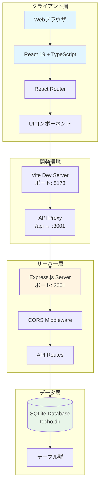
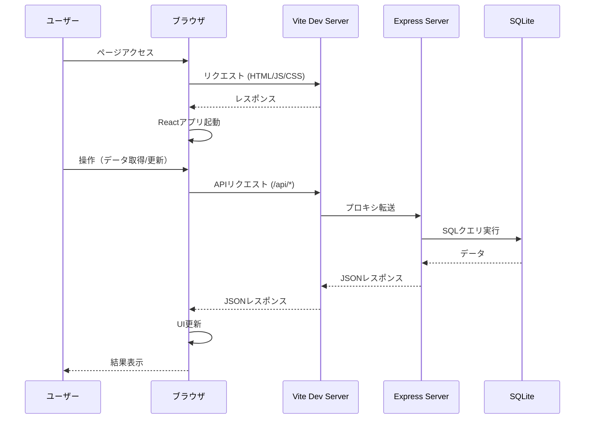
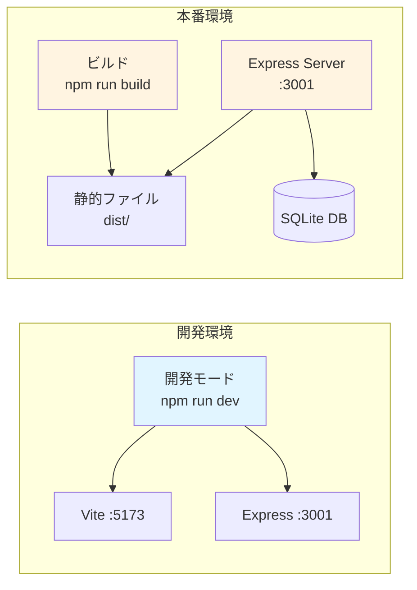

# システムアーキテクチャ

## システム概要

「手帳（Techo）」は、個人の日々のスケジュール、習慣、日記、目標を管理するためのデジタル手帳アプリケーションです。

## システム構成図



## 技術スタック

### フロントエンド
- **React 19.2.0** - UIフレームワーク
- **TypeScript 5.9.3** - 型安全性
- **Vite 7.3.1** - ビルドツール・開発サーバー
- **React Router 7.13.0** - ルーティング
- **Tailwind CSS 4.1.18** - スタイリング

### バックエンド
- **Express.js 5.2.1** - Webサーバー
- **TypeScript 5.9.3** - 型安全性
- **better-sqlite3 12.6.2** - SQLiteデータベースドライバ
- **CORS 2.8.6** - クロスオリジンリソース共有

### データベース
- **SQLite** - リレーショナルデータベース（ファイルベース）

## ディレクトリ構造

```
techo-app/
├── src/                    # フロントエンドソースコード
│   ├── components/         # Reactコンポーネント
│   ├── hooks/              # カスタムフック
│   ├── App.tsx             # メインアプリケーション
│   └── main.tsx            # エントリーポイント
├── server/                 # バックエンドソースコード
│   ├── routes/             # APIルート定義
│   ├── db.ts               # データベース接続・初期化
│   └── index.ts            # サーバーエントリーポイント
├── data/                   # データベースファイル
│   └── techo.db            # SQLiteデータベース
├── public/                 # 静的ファイル
├── dist/                   # ビルド成果物
└── docs/                   # ドキュメント
```

## 通信フロー



## デプロイ構成


