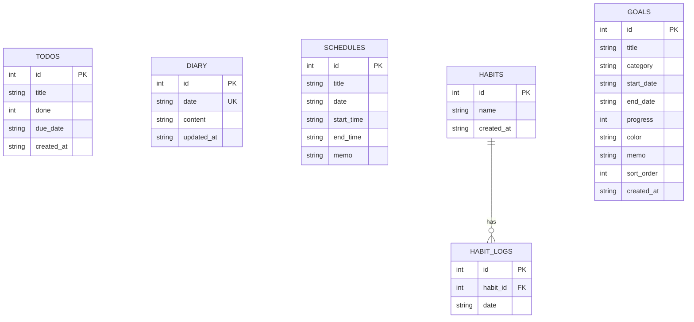
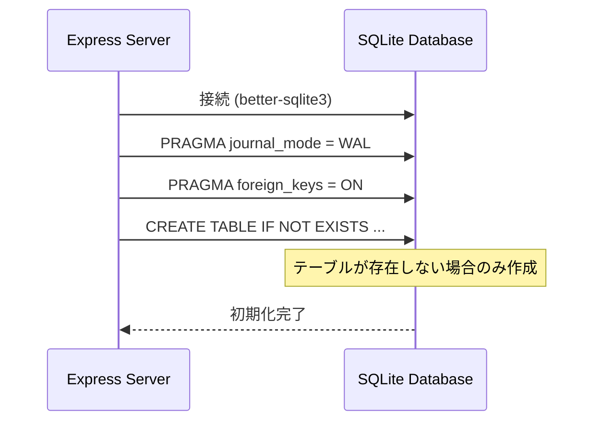
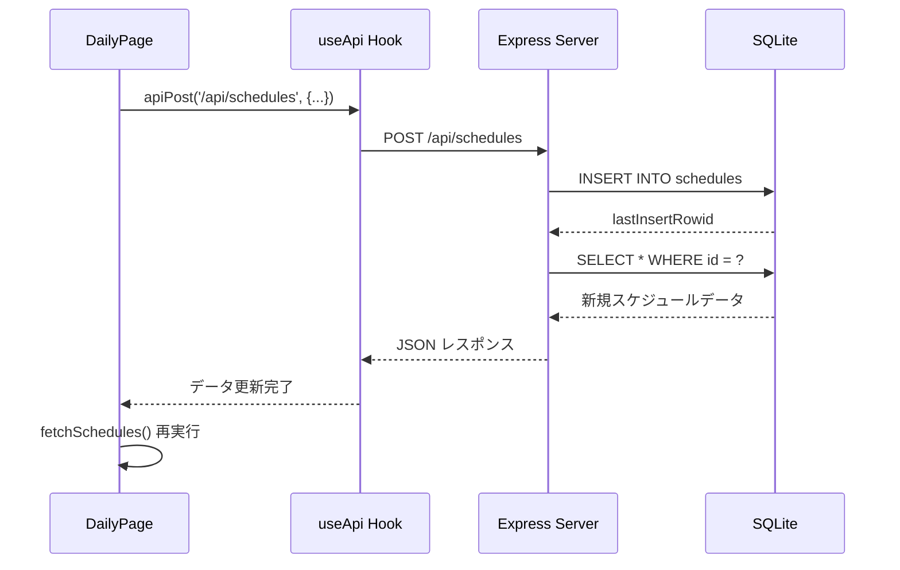
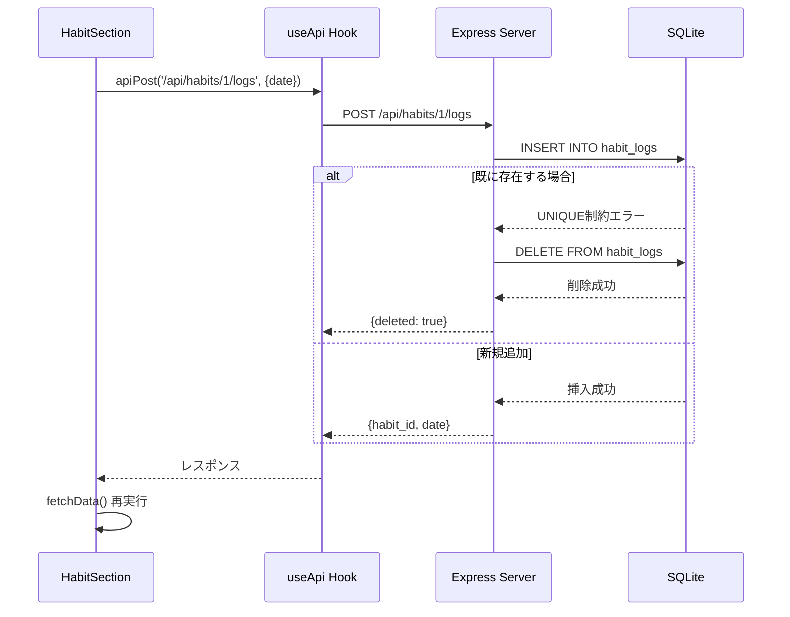

# データベース設計

## ER図

## テーブル定義

### todos（タスク管理）

| カラム名 | 型 | 制約 | 説明 |
|---------|-----|------|------|
| id | INTEGER | PRIMARY KEY, AUTOINCREMENT | タスクID |
| title | TEXT | NOT NULL | タスクタイトル |
| done | INTEGER | NOT NULL, DEFAULT 0 | 完了フラグ（0:未完了, 1:完了） |
| due_date | TEXT | NULL | 期限日（YYYY-MM-DD形式） |
| created_at | TEXT | NOT NULL, DEFAULT (datetime('now', 'localtime')) | 作成日時 |

**用途**: タスク管理機能（現在はUIに未実装だが、データベースとAPIは準備済み）

### diary（日記）

| カラム名 | 型 | 制約 | 説明 |
|---------|-----|------|------|
| id | INTEGER | PRIMARY KEY, AUTOINCREMENT | 日記ID |
| date | TEXT | NOT NULL, UNIQUE | 日付（YYYY-MM-DD形式） |
| content | TEXT | NOT NULL, DEFAULT '' | 日記の内容 |
| updated_at | TEXT | NOT NULL, DEFAULT (datetime('now', 'localtime')) | 更新日時 |

**用途**: 日付ごとの日記を保存。1日1エントリ。

### schedules（スケジュール）

| カラム名 | 型 | 制約 | 説明 |
|---------|-----|------|------|
| id | INTEGER | PRIMARY KEY, AUTOINCREMENT | スケジュールID |
| title | TEXT | NOT NULL | 予定タイトル |
| date | TEXT | NOT NULL | 日付（YYYY-MM-DD形式） |
| start_time | TEXT | NULL | 開始時刻（HH:MM形式） |
| end_time | TEXT | NULL | 終了時刻（HH:MM形式） |
| memo | TEXT | NULL | メモ |

**用途**: 日々のスケジュール管理。時間指定あり/なしの両方に対応。

### habits（習慣）

| カラム名 | 型 | 制約 | 説明 |
|---------|-----|------|------|
| id | INTEGER | PRIMARY KEY, AUTOINCREMENT | 習慣ID |
| name | TEXT | NOT NULL | 習慣名 |
| created_at | TEXT | NOT NULL, DEFAULT (datetime('now', 'localtime')) | 作成日時 |

**用途**: 習慣の定義を保存。

### habit_logs（習慣ログ）

| カラム名 | 型 | 制約 | 説明 |
|---------|-----|------|------|
| id | INTEGER | PRIMARY KEY, AUTOINCREMENT | ログID |
| habit_id | INTEGER | NOT NULL, FK → habits(id) | 習慣ID |
| date | TEXT | NOT NULL | 実行日（YYYY-MM-DD形式） |
| UNIQUE(habit_id, date) | | | 1習慣1日1回のみ記録可能 |

**用途**: 習慣の実行記録。同じ習慣を同じ日に複数回記録できない。

**外部キー制約**: `ON DELETE CASCADE` - 習慣が削除されると関連ログも自動削除

### goals（目標）

| カラム名 | 型 | 制約 | 説明 |
|---------|-----|------|------|
| id | INTEGER | PRIMARY KEY, AUTOINCREMENT | 目標ID |
| title | TEXT | NOT NULL | 目標タイトル |
| category | TEXT | NOT NULL, DEFAULT '' | カテゴリ |
| start_date | TEXT | NOT NULL | 開始日（YYYY-MM-DD形式） |
| end_date | TEXT | NOT NULL | 終了日（YYYY-MM-DD形式） |
| progress | INTEGER | NOT NULL, DEFAULT 0 | 進捗率（0-100） |
| color | TEXT | NOT NULL, DEFAULT 'amber' | 表示色 |
| memo | TEXT | NULL | メモ |
| sort_order | INTEGER | NOT NULL, DEFAULT 0 | ソート順 |
| created_at | TEXT | NOT NULL, DEFAULT (datetime('now', 'localtime')) | 作成日時 |

**用途**: 長期目標の管理。ガントチャート表示用。

## データベース初期化

データベースは `server/db.ts` で自動初期化されます：

**設定**:
- **WALモード**: 書き込み性能向上
- **外部キー制約**: 有効化（データ整合性保証）

## データフロー例

### スケジュール追加の例

### 習慣ログのトグル例

