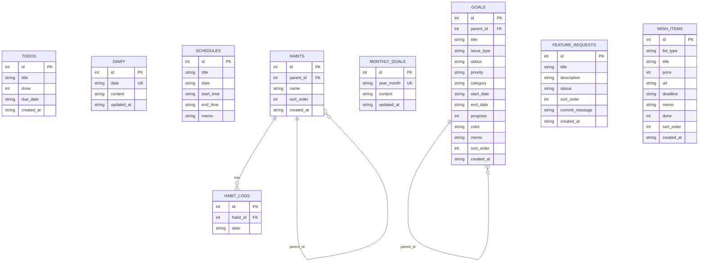

# データベース設計

## 概要

SQLite をファイルベース（`data/techo.db`）で使用。`better-sqlite3` による同期的操作。
起動時にテーブルが存在しなければ自動作成される。

- **WAL モード**: 書き込み性能向上
- **外部キー制約**: 有効化（データ整合性保証）

## ER図

## テーブル定義

### todos（タスク管理）

| カラム名 | 型 | 制約 | 説明 |
|---------|-----|------|------|
| id | INTEGER | PRIMARY KEY, AUTOINCREMENT | タスクID |
| title | TEXT | NOT NULL | タスクタイトル |
| done | INTEGER | NOT NULL, DEFAULT 0 | 完了フラグ（0:未完了, 1:完了） |
| due_date | TEXT | NULL | 期限日（YYYY-MM-DD） |
| created_at | TEXT | NOT NULL, DEFAULT (datetime('now', 'localtime')) | 作成日時 |

### diary（日記）

| カラム名 | 型 | 制約 | 説明 |
|---------|-----|------|------|
| id | INTEGER | PRIMARY KEY, AUTOINCREMENT | 日記ID |
| date | TEXT | NOT NULL, UNIQUE | 日付（YYYY-MM-DD） |
| content | TEXT | NOT NULL, DEFAULT '' | 日記の内容（BlockNote JSON） |
| updated_at | TEXT | NOT NULL, DEFAULT (datetime('now', 'localtime')) | 更新日時 |

1日1エントリ。BlockNote リッチテキストエディタの JSON 形式で保存。

### schedules（スケジュール）

| カラム名 | 型 | 制約 | 説明 |
|---------|-----|------|------|
| id | INTEGER | PRIMARY KEY, AUTOINCREMENT | スケジュールID |
| title | TEXT | NOT NULL | 予定タイトル |
| date | TEXT | NOT NULL | 日付（YYYY-MM-DD） |
| start_time | TEXT | NULL | 開始時刻（HH:MM） |
| end_time | TEXT | NULL | 終了時刻（HH:MM） |
| memo | TEXT | NULL | メモ |

時間指定あり / なしの両方に対応。

### habits（習慣）

| カラム名 | 型 | 制約 | 説明 |
|---------|-----|------|------|
| id | INTEGER | PRIMARY KEY, AUTOINCREMENT | 習慣ID |
| parent_id | INTEGER | NULL, FK → habits(id) ON DELETE CASCADE | 親習慣ID |
| name | TEXT | NOT NULL | 習慣名 |
| sort_order | INTEGER | NOT NULL, DEFAULT 0 | ソート順 |
| created_at | TEXT | NOT NULL, DEFAULT (datetime('now', 'localtime')) | 作成日時 |

- **階層構造**: `parent_id` による親子関係。親習慣（グループ）と子習慣の2階層
- **カスケード削除**: 親習慣削除時に子習慣・関連ログも自動削除
- **ソート**: 同一親グループ内で `sort_order ASC, id ASC`

### habit_logs（習慣ログ）

| カラム名 | 型 | 制約 | 説明 |
|---------|-----|------|------|
| id | INTEGER | PRIMARY KEY, AUTOINCREMENT | ログID |
| habit_id | INTEGER | NOT NULL, FK → habits(id) ON DELETE CASCADE | 習慣ID |
| date | TEXT | NOT NULL | 実行日（YYYY-MM-DD） |

- UNIQUE(habit_id, date): 1習慣1日1回のみ記録可能
- 習慣が削除されると関連ログも自動削除（CASCADE）

### goals（目標）

| カラム名 | 型 | 制約 | 説明 |
|---------|-----|------|------|
| id | INTEGER | PRIMARY KEY, AUTOINCREMENT | 目標ID |
| parent_id | INTEGER | NULL, FK → goals(id) ON DELETE CASCADE | 親目標ID |
| title | TEXT | NOT NULL | 目標タイトル |
| issue_type | TEXT | NOT NULL, DEFAULT 'task' | 種別（epic/story/task/subtask） |
| status | TEXT | NOT NULL, DEFAULT 'todo' | ステータス（todo/in_progress/done） |
| priority | TEXT | NOT NULL, DEFAULT 'medium' | 優先度（low/medium/high） |
| category | TEXT | NOT NULL, DEFAULT '' | カテゴリ |
| start_date | TEXT | NOT NULL | 開始日（YYYY-MM-DD） |
| end_date | TEXT | NOT NULL | 終了日（YYYY-MM-DD） |
| progress | INTEGER | NOT NULL, DEFAULT 0 | 進捗率（0-100） |
| color | TEXT | NOT NULL, DEFAULT 'amber' | 表示色 |
| memo | TEXT | NULL | メモ |
| sort_order | INTEGER | NOT NULL, DEFAULT 0 | ソート順 |
| created_at | TEXT | NOT NULL, DEFAULT (datetime('now', 'localtime')) | 作成日時 |

- **階層構造**: `parent_id` による自己参照で Epic > Story > Task > Subtask の4階層を表現
- **期間伝播**: 子の期間変更時、`syncParentDates` により親の期間が自動調整される
- **カスケード削除**: 親目標の削除時に子目標も自動削除

### feature_requests（Feature Request）

| カラム名 | 型 | 制約 | 説明 |
|---------|-----|------|------|
| id | INTEGER | PRIMARY KEY, AUTOINCREMENT | リクエストID |
| title | TEXT | NOT NULL | 機能名 |
| description | TEXT | NOT NULL, DEFAULT '' | 詳細仕様 |
| status | TEXT | NOT NULL, DEFAULT 'pending' | ステータス |
| sort_order | INTEGER | NOT NULL, DEFAULT 0 | ソート順（優先順位） |
| commit_message | TEXT | NOT NULL, DEFAULT '' | 実装コミットのハッシュ＋メッセージ |
| created_at | TEXT | NOT NULL, DEFAULT (datetime('now', 'localtime')) | 作成日時 |

- **ステータス**: `pending` / `in_progress` / `done` / `rejected`（CHECK 制約）
- **commit_message**: git push 完了後に `<hash> <subject>` 形式で記録（例: `abc1234 feat: ダイアリーチェックリスト実装`）

### monthly_goals（月の目標）

| カラム名 | 型 | 制約 | 説明 |
|---------|-----|------|------|
| id | INTEGER | PRIMARY KEY, AUTOINCREMENT | レコードID |
| year_month | TEXT | NOT NULL, UNIQUE | 年月（YYYY-MM） |
| content | TEXT | NOT NULL, DEFAULT '' | 目標内容（自由記載テキスト） |
| updated_at | TEXT | NOT NULL, DEFAULT (datetime('now', 'localtime')) | 更新日時 |

- 月ごとに1レコード（UPSERT で管理）
- `content` は自由記載の単行テキストを想定

### wish_items（ウィッシュアイテム）

| カラム名 | 型 | 制約 | 説明 |
|---------|-----|------|------|
| id | INTEGER | PRIMARY KEY, AUTOINCREMENT | アイテムID |
| list_type | TEXT | NOT NULL, DEFAULT 'wish' | リスト種別 |
| title | TEXT | NOT NULL | タイトル |
| price | INTEGER | NULL | 価格（wish のみ） |
| url | TEXT | NULL | URL（商品ページ / 参考ページ） |
| deadline | TEXT | NULL | 期限（YYYY-MM-DD） |
| memo | TEXT | NULL | メモ |
| done | INTEGER | NOT NULL, DEFAULT 0 | 完了フラグ |
| sort_order | INTEGER | NOT NULL, DEFAULT 0 | ソート順 |
| created_at | TEXT | NOT NULL, DEFAULT (datetime('now', 'localtime')) | 作成日時 |

- **リスト種別**: `wish`（買いたいもの）/ `bucket`（やりたいこと）（CHECK 制約）
