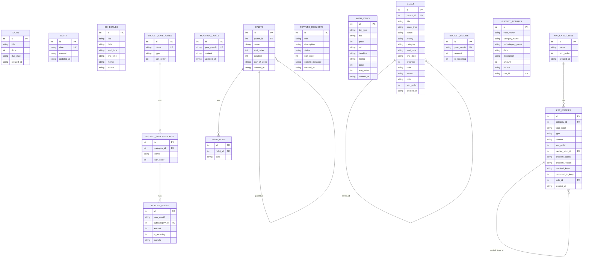

# データベース設計

## 概要

SQLite をファイルベース（`data/techo.db`）で使用。`better-sqlite3` による同期的操作。
起動時にテーブルが存在しなければ自動作成される。

- **DELETE モード**: GCSFuse 互換（`journal_mode=DELETE`）
- **外部キー制約**: 有効化（データ整合性保証）

## ER図

```mermaid
erDiagram
    TODOS {
        int id PK
        string title
        int done
        string due_date
        string created_at
    }

    DIARY {
        int id PK
        string date UK
        string content
        string updated_at
    }

    SCHEDULES {
        int id PK
        string title
        string date
        string start_time
        string end_time
        string memo
        string source
    }

    HABITS {
        int id PK
        int parent_id FK
        string name
        int sort_order
        int duration
        string day_of_week
        string created_at
    }

    HABIT_LOGS {
        int id PK
        int habit_id FK
        string date
    }

    MONTHLY_GOALS {
        int id PK
        string year_month UK
        string content
        string updated_at
    }

    GOALS {
        int id PK
        int parent_id FK
        string title
        string issue_type
        string status
        string priority
        string category
        string start_date
        string end_date
        int progress
        string color
        string memo
        string note
        int sort_order
        string created_at
    }

    FEATURE_REQUESTS {
        int id PK
        string title
        string description
        string status
        int sort_order
        string commit_message
        string created_at
    }

    WISH_ITEMS {
        int id PK
        string list_type
        string title
        int price
        string url
        string deadline
        string memo
        int done
        int sort_order
        string created_at
    }

    BUDGET_CATEGORIES {
        int id PK
        string name UK
        string type
        int sort_order
    }

    BUDGET_SUBCATEGORIES {
        int id PK
        int category_id FK
        string name
        int sort_order
    }

    BUDGET_PLANS {
        int id PK
        string year_month
        int subcategory_id FK
        int amount
        int is_recurring
        string formula
    }

    BUDGET_INCOME {
        int id PK
        string year_month UK
        int amount
        int is_recurring
    }

    BUDGET_ACTUALS {
        int id PK
        string year_month
        string category_name
        string subcategory_name
        string date
        string description
        int amount
        string source
        string csv_id UK
    }

    HABITS ||--o{ HABIT_LOGS : "has"
    HABITS ||--o{ HABITS : "parent_id"
    GOALS ||--o{ GOALS : "parent_id"
    KPT_CATEGORIES {
        int id PK
        string name
        int sort_order
        string created_at
    }

    KPT_ENTRIES {
        int id PK
        int category_id FK
        string year_week
        string type
        string content
        int sort_order
        int carried_from_id FK
        string problem_status
        string problem_reason
        string resolved_keep
        int promoted_to_keep
        int todo_id FK
        string created_at
    }

    BUDGET_CATEGORIES ||--o{ BUDGET_SUBCATEGORIES : "has"
    BUDGET_SUBCATEGORIES ||--o{ BUDGET_PLANS : "has"
    KPT_CATEGORIES ||--o{ KPT_ENTRIES : "has"
    KPT_ENTRIES ||--o{ KPT_ENTRIES : "carried_from_id"
```

## テーブル定義

### todos（タスク管理）

| カラム名 | 型 | 制約 | 説明 |
|---------|-----|------|------|
| id | INTEGER | PRIMARY KEY, AUTOINCREMENT | タスクID |
| title | TEXT | NOT NULL | タスクタイトル |
| done | INTEGER | NOT NULL, DEFAULT 0 | 完了フラグ（0:未完了, 1:完了） |
| due_date | TEXT | NULL | 期限日（YYYY-MM-DD） |
| created_at | TEXT | NOT NULL, DEFAULT (datetime('now', 'localtime')) | 作成日時 |

### diary（日記）

| カラム名 | 型 | 制約 | 説明 |
|---------|-----|------|------|
| id | INTEGER | PRIMARY KEY, AUTOINCREMENT | 日記ID |
| date | TEXT | NOT NULL, UNIQUE | 日付（YYYY-MM-DD） |
| content | TEXT | NOT NULL, DEFAULT '' | 日記の内容（BlockNote JSON） |
| updated_at | TEXT | NOT NULL, DEFAULT (datetime('now', 'localtime')) | 更新日時 |

1日1エントリ。BlockNote リッチテキストエディタの JSON 形式で保存。

### schedules（スケジュール）

| カラム名 | 型 | 制約 | 説明 |
|---------|-----|------|------|
| id | INTEGER | PRIMARY KEY, AUTOINCREMENT | スケジュールID |
| title | TEXT | NOT NULL | 予定タイトル |
| date | TEXT | NOT NULL | 日付（YYYY-MM-DD） |
| start_time | TEXT | NULL | 開始時刻（HH:MM） |
| end_time | TEXT | NULL | 終了時刻（HH:MM） |
| memo | TEXT | NULL | メモ |
| source | TEXT | NULL | 作成元（`'habit'`: 習慣D&Dで作成、NULL: 通常） |

時間指定あり / なしの両方に対応。習慣のドラッグ＆ドロップで作成したスケジュールは `source = 'habit'` で識別されカレンダーには表示されない。

### habits（習慣）

| カラム名 | 型 | 制約 | 説明 |
|---------|-----|------|------|
| id | INTEGER | PRIMARY KEY, AUTOINCREMENT | 習慣ID |
| parent_id | INTEGER | NULL, FK → habits(id) ON DELETE CASCADE | 親習慣ID（グループ） |
| name | TEXT | NOT NULL | 習慣名 |
| sort_order | INTEGER | NOT NULL, DEFAULT 0 | ソート順 |
| duration | INTEGER | NOT NULL, DEFAULT 30 | 所要時間（分） |
| day_of_week | TEXT | NOT NULL, DEFAULT '' | 実行曜日（カンマ区切り数字列、0=日〜6=土） |
| created_at | TEXT | NOT NULL, DEFAULT (datetime('now', 'localtime')) | 作成日時 |

- **階層構造**: `parent_id` による親子関係。親習慣（グループ）と子習慣の2階層
- **カスケード削除**: 親習慣削除時に子習慣・関連ログも自動削除
- **ソート**: 同一親グループ内で `sort_order ASC, id ASC`
- **day_of_week**: 空文字の場合はどの曜日にも表示されない。例: `"1,2,3,4,5"` = 平日

### habit_logs（習慣ログ）

| カラム名 | 型 | 制約 | 説明 |
|---------|-----|------|------|
| id | INTEGER | PRIMARY KEY, AUTOINCREMENT | ログID |
| habit_id | INTEGER | NOT NULL, FK → habits(id) ON DELETE CASCADE | 習慣ID |
| date | TEXT | NOT NULL | 実行日（YYYY-MM-DD） |

- UNIQUE(habit_id, date): 1習慣1日1回のみ記録可能
- 習慣が削除されると関連ログも自動削除（CASCADE）

### goals（目標）

| カラム名 | 型 | 制約 | 説明 |
|---------|-----|------|------|
| id | INTEGER | PRIMARY KEY, AUTOINCREMENT | 目標ID |
| parent_id | INTEGER | NULL, FK → goals(id) ON DELETE CASCADE | 親目標ID |
| title | TEXT | NOT NULL | 目標タイトル |
| issue_type | TEXT | NOT NULL, DEFAULT 'task' | 種別（epic/story/task/subtask） |
| status | TEXT | NOT NULL, DEFAULT 'todo' | ステータス（todo/in_progress/done） |
| priority | TEXT | NOT NULL, DEFAULT 'medium' | 優先度（low/medium/high） |
| category | TEXT | NOT NULL, DEFAULT '' | カテゴリ |
| start_date | TEXT | NOT NULL | 開始日（YYYY-MM-DD） |
| end_date | TEXT | NOT NULL | 終了日（YYYY-MM-DD） |
| progress | INTEGER | NOT NULL, DEFAULT 0 | 進捗率（0-100） |
| color | TEXT | NOT NULL, DEFAULT 'amber' | 表示色 |
| memo | TEXT | NULL | メモ |
| note | TEXT | NULL | ノート（BlockNote JSON） |
| sort_order | INTEGER | NOT NULL, DEFAULT 0 | ソート順 |
| created_at | TEXT | NOT NULL, DEFAULT (datetime('now', 'localtime')) | 作成日時 |

- **階層構造**: `parent_id` による自己参照で Epic > Story > Task > Subtask の4階層を表現
- **ノート**: BlockNote リッチテキストエディタの JSON 形式で保存。進捗メモや詳細記録に使用
- **期間伝播**: 子の期間変更時、`syncParentDates` により親の期間が自動調整される
- **カスケード削除**: 親目標の削除時に子目標も自動削除

### feature_requests（Feature Request）

| カラム名 | 型 | 制約 | 説明 |
|---------|-----|------|------|
| id | INTEGER | PRIMARY KEY, AUTOINCREMENT | リクエストID |
| title | TEXT | NOT NULL | 機能名 |
| description | TEXT | NOT NULL, DEFAULT '' | 詳細仕様 |
| status | TEXT | NOT NULL, DEFAULT 'pending' | ステータス |
| sort_order | INTEGER | NOT NULL, DEFAULT 0 | ソート順（優先順位） |
| commit_message | TEXT | NOT NULL, DEFAULT '' | 実装コミットのハッシュ＋メッセージ |
| created_at | TEXT | NOT NULL, DEFAULT (datetime('now', 'localtime')) | 作成日時 |

- **ステータス**: `pending` / `in_progress` / `done` / `rejected`（CHECK 制約）
- **commit_message**: git push 完了後に `<hash> <subject>` 形式で記録（例: `abc1234 feat: ダイアリーチェックリスト実装`）

### monthly_goals（月の目標）

| カラム名 | 型 | 制約 | 説明 |
|---------|-----|------|------|
| id | INTEGER | PRIMARY KEY, AUTOINCREMENT | レコードID |
| year_month | TEXT | NOT NULL, UNIQUE | 年月（YYYY-MM） |
| content | TEXT | NOT NULL, DEFAULT '' | 目標内容（自由記載テキスト） |
| updated_at | TEXT | NOT NULL, DEFAULT (datetime('now', 'localtime')) | 更新日時 |

- 月ごとに1レコード（UPSERT で管理）
- `content` は自由記載の単行テキストを想定

### wish_items（ウィッシュアイテム）

| カラム名 | 型 | 制約 | 説明 |
|---------|-----|------|------|
| id | INTEGER | PRIMARY KEY, AUTOINCREMENT | アイテムID |
| list_type | TEXT | NOT NULL, DEFAULT 'wish' | リスト種別 |
| title | TEXT | NOT NULL | タイトル |
| price | INTEGER | NULL | 価格（wish のみ） |
| url | TEXT | NULL | URL（商品ページ / 参考ページ） |
| deadline | TEXT | NULL | 期限（YYYY-MM-DD） |
| memo | TEXT | NULL | メモ |
| done | INTEGER | NOT NULL, DEFAULT 0 | 完了フラグ |
| sort_order | INTEGER | NOT NULL, DEFAULT 0 | ソート順 |
| created_at | TEXT | NOT NULL, DEFAULT (datetime('now', 'localtime')) | 作成日時 |

- **リスト種別**: `wish`（買いたいもの）/ `bucket`（やりたいこと）（CHECK 制約）

### budget_categories（予算カテゴリ）

| カラム名 | 型 | 制約 | 説明 |
|---------|-----|------|------|
| id | INTEGER | PRIMARY KEY, AUTOINCREMENT | カテゴリID |
| name | TEXT | NOT NULL, UNIQUE | カテゴリ名 |
| type | TEXT | NOT NULL, CHECK('fixed','variable') | 種別（fixed:固定費, variable:変動費） |
| sort_order | INTEGER | NOT NULL, DEFAULT 0 | ソート順 |

- 初回起動時にシードデータ（16カテゴリ）が自動挿入される

### budget_subcategories（予算サブカテゴリ）

| カラム名 | 型 | 制約 | 説明 |
|---------|-----|------|------|
| id | INTEGER | PRIMARY KEY, AUTOINCREMENT | サブカテゴリID |
| category_id | INTEGER | NOT NULL, FK → budget_categories(id) ON DELETE CASCADE | 親カテゴリID |
| name | TEXT | NOT NULL | サブカテゴリ名 |
| sort_order | INTEGER | NOT NULL, DEFAULT 0 | ソート順 |

- UNIQUE(category_id, name): 同一カテゴリ内で名前の重複不可

### budget_plans（予算計画）

| カラム名 | 型 | 制約 | 説明 |
|---------|-----|------|------|
| id | INTEGER | PRIMARY KEY, AUTOINCREMENT | プランID |
| year_month | TEXT | NOT NULL | 年月（YYYY-MM） |
| subcategory_id | INTEGER | NOT NULL, FK → budget_subcategories(id) ON DELETE CASCADE | サブカテゴリID |
| amount | INTEGER | NOT NULL, DEFAULT 0 | 金額 |
| is_recurring | INTEGER | NOT NULL, DEFAULT 1 | 毎月繰越フラグ（1:繰越, 0:単月） |
| formula | TEXT | NULL | 計算式データ（JSON配列） |

- UNIQUE(year_month, subcategory_id): 同一月のサブカテゴリに1レコードのみ
- **formula**: `[{label, amount, multiplier}]` 形式のJSON。計算式モードで金額を構造化管理する場合に使用。直接入力モードでは null

### budget_income（予算収入）

| カラム名 | 型 | 制約 | 説明 |
|---------|-----|------|------|
| id | INTEGER | PRIMARY KEY, AUTOINCREMENT | 収入ID |
| year_month | TEXT | NOT NULL, UNIQUE | 年月（YYYY-MM） |
| amount | INTEGER | NOT NULL, DEFAULT 0 | 収入金額 |
| is_recurring | INTEGER | NOT NULL, DEFAULT 1 | 毎月繰越フラグ |

### budget_actuals（予算実績）

| カラム名 | 型 | 制約 | 説明 |
|---------|-----|------|------|
| id | INTEGER | PRIMARY KEY, AUTOINCREMENT | 実績ID |
| year_month | TEXT | NOT NULL | 年月（YYYY-MM） |
| category_name | TEXT | NOT NULL | カテゴリ名 |
| subcategory_name | TEXT | NOT NULL, DEFAULT '' | サブカテゴリ名 |
| date | TEXT | NOT NULL | 日付（YYYY-MM-DD） |
| description | TEXT | NOT NULL, DEFAULT '' | 摘要 |
| amount | INTEGER | NOT NULL | 金額 |
| source | TEXT | NOT NULL, DEFAULT '' | 取込元 |
| csv_id | TEXT | UNIQUE | CSV重複防止ID |

### kpt_categories（KPTカテゴリ）

| カラム名 | 型 | 制約 | 説明 |
|---------|-----|------|------|
| id | INTEGER | PRIMARY KEY, AUTOINCREMENT | カテゴリID |
| name | TEXT | NOT NULL | カテゴリ名（テーマ） |
| sort_order | INTEGER | NOT NULL, DEFAULT 0 | ソート順 |
| created_at | TEXT | NOT NULL, DEFAULT (datetime('now', 'localtime')) | 作成日時 |

### kpt_entries（KPTエントリ）

| カラム名 | 型 | 制約 | 説明 |
|---------|-----|------|------|
| id | INTEGER | PRIMARY KEY, AUTOINCREMENT | エントリID |
| category_id | INTEGER | NOT NULL, FK → kpt_categories(id) ON DELETE CASCADE | カテゴリID |
| year_week | TEXT | NOT NULL | ISO週番号（例: `2026-W14`） |
| type | TEXT | NOT NULL, CHECK('keep','problem','try') | K/P/T 種別 |
| content | TEXT | NOT NULL | 内容 |
| sort_order | INTEGER | NOT NULL, DEFAULT 0 | ソート順 |
| carried_from_id | INTEGER | NULL, FK → kpt_entries(id) ON DELETE SET NULL | 引き継ぎ元エントリID |
| problem_status | TEXT | NULL, CHECK('resolved','unresolved','partial') | Problem の評価状態 |
| problem_reason | TEXT | NULL | 未解決/部分解決の理由 |
| resolved_keep | TEXT | NULL | 効果があった Keep（Problem 解決時） |
| promoted_to_keep | INTEGER | NOT NULL, DEFAULT 0 | Keep 昇格フラグ |
| todo_id | INTEGER | NULL, FK → todos(id) ON DELETE SET NULL | タスク変換先 |
| created_at | TEXT | NOT NULL, DEFAULT (datetime('now', 'localtime')) | 作成日時 |

- **引き継ぎ**: `carried_from_id` で元エントリを参照。Keep の週間継続、Try→Keep 昇格、Problem の未解決引き継ぎに使用
- **自動昇格**: Try に content を保存すると自動的に次週の Keep エントリが作成される
- **Problem 引き継ぎ**: 未解決/部分解決と評価された Problem は自動的に次週に引き継がれる（理由付き）
