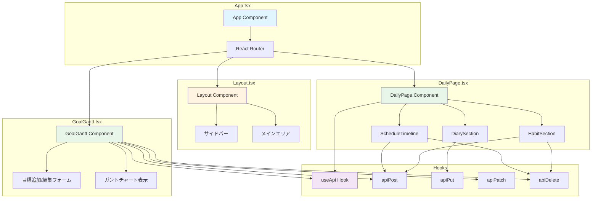
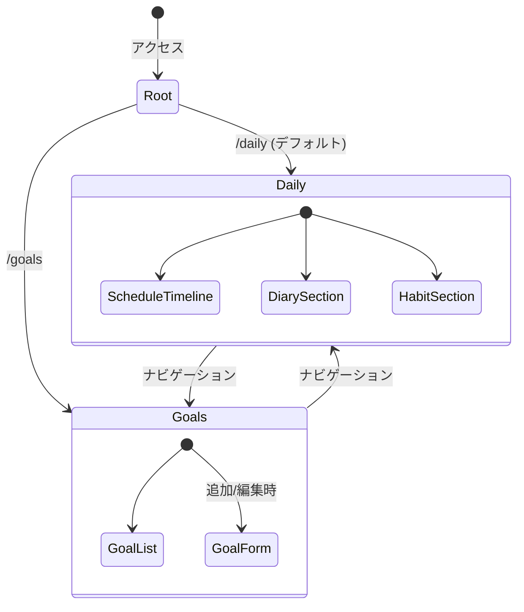
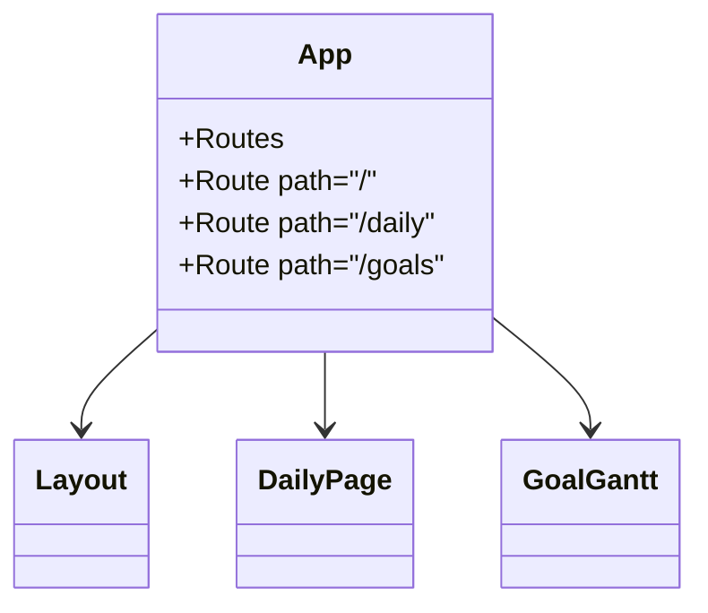
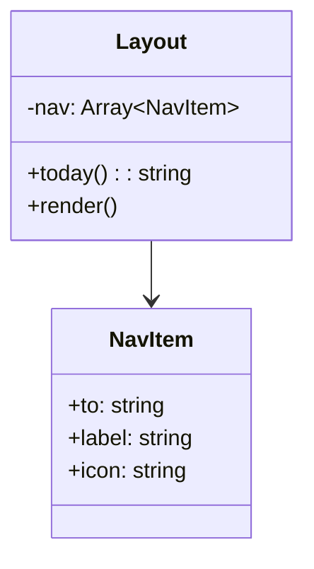
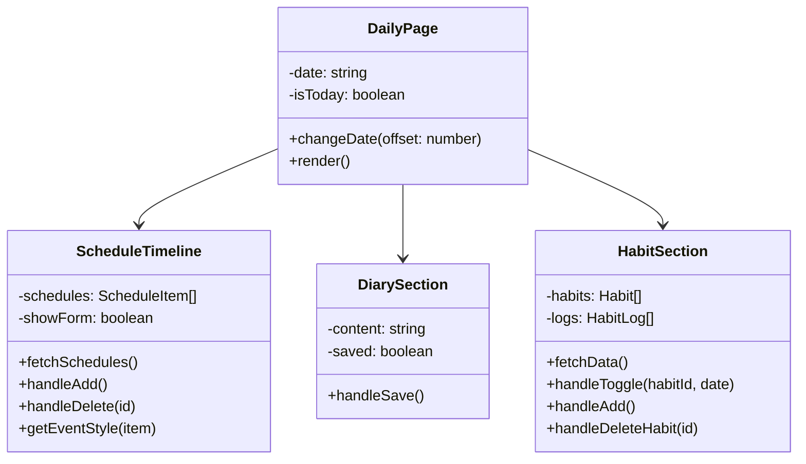
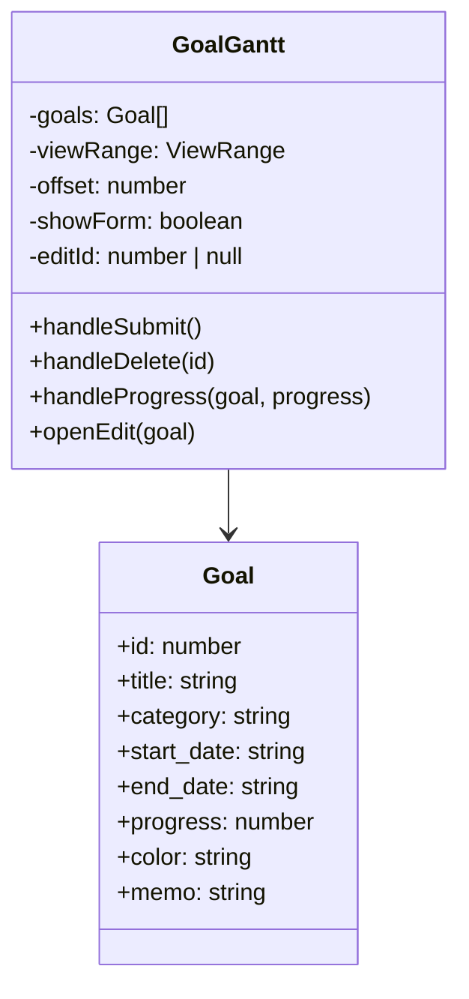
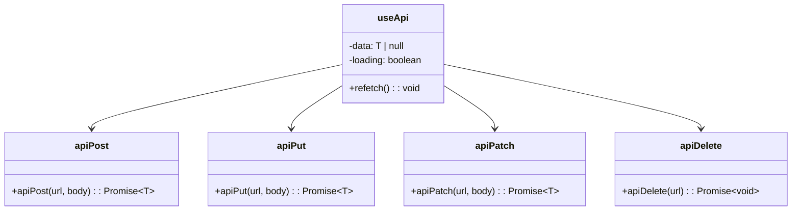
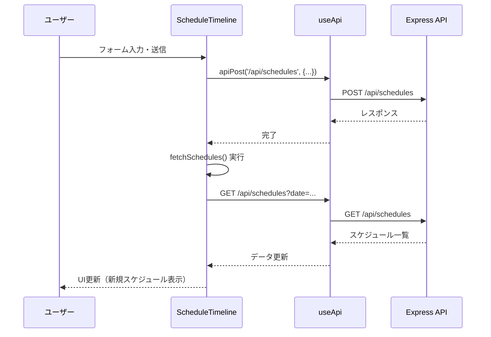
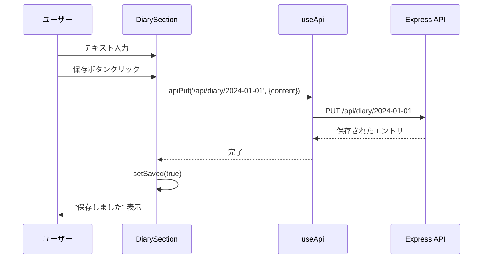
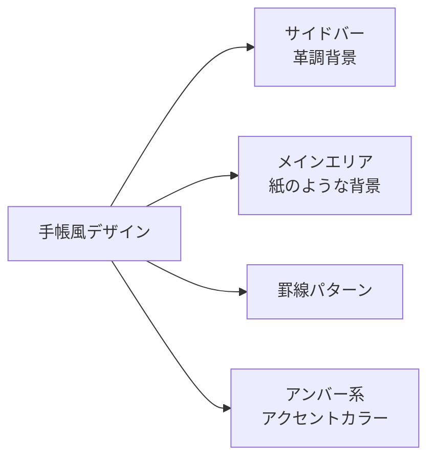

# フロントエンド構成

## コンポーネント階層図



## ルーティング構成



## コンポーネント詳細

### App.tsx

**役割**: アプリケーションのルートコンポーネント、ルーティング定義



### Layout.tsx

**役割**: 共通レイアウト（サイドバー + メインエリア）



**機能**:
- サイドバーにナビゲーション表示
- 今日の日付表示
- アクティブなページのハイライト

### DailyPage.tsx

**役割**: デイリーページのメインコンポーネント



**状態管理**:
- 選択中の日付（`date`）
- 各セクションのデータ（スケジュール、日記、習慣）

### GoalGantt.tsx

**役割**: 目標管理とガントチャート表示



**機能**:
- 1ヶ月/3ヶ月/6ヶ月/1年の表示範囲切り替え
- 月単位のスクロール
- カテゴリ別のグループ化
- 進捗率の更新（+/-10%）
- 目標の追加・編集・削除

## カスタムフック

### useApi.ts

**役割**: API通信の共通ロジック



**使用例**:
```typescript
const { data: goals, loading, refetch } = useApi<Goal[]>('/api/goals');
```

## データフロー

### スケジュール追加のフロー



### 日記保存のフロー



## スタイリング

### デザインコンセプト



**CSS構成**:
- `index.css`: グローバルスタイル、カスタムクラス
- Tailwind CSS: ユーティリティクラス
- カスタムクラス:
  - `.sidebar`: サイドバースタイル
  - `.sidebar-link`: ナビゲーションリンク
  - `.page-area`: メインエリア（罫線付き背景）
  - `.techo-heading`: 見出しスタイル
